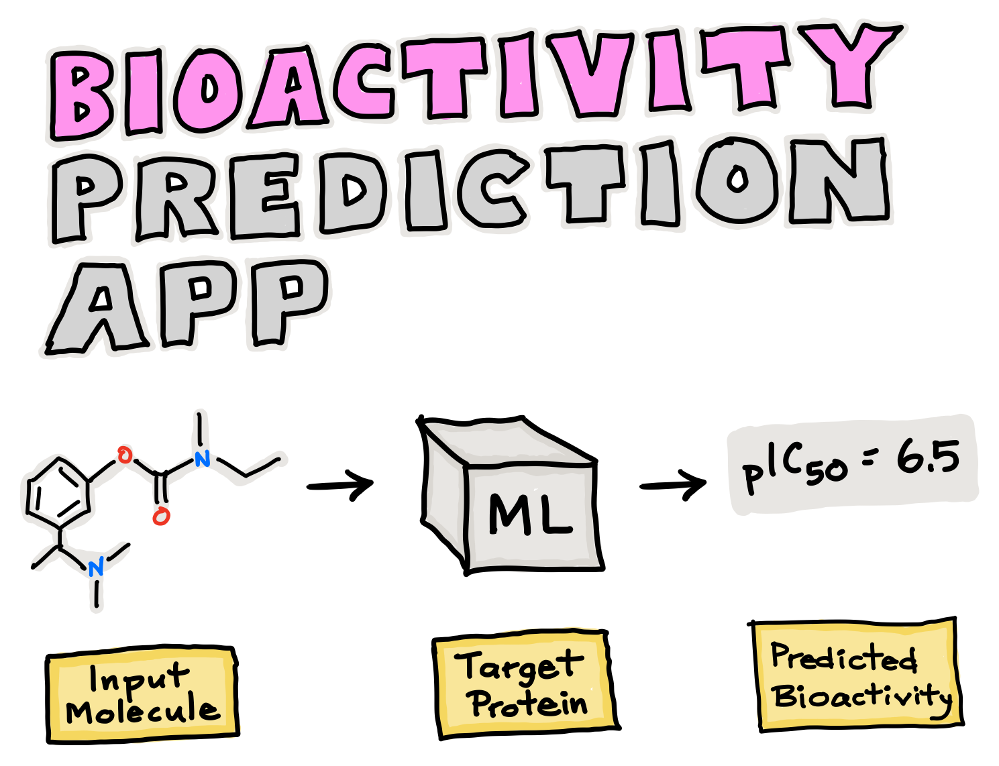

### PYTHON FOR BIOINFORMATICS - DRUG DISCOVERY USING  MACHINE LERNING

### Part 1
---
Download Bioactivity Data
 
### Part 2
---
Exploratory Data Analysis
 
### Part 3
---
Descriptor Calculation and Dataset Preparation
 
### Part 4
---
Regression Models with Random Forest
 
### Part 5
Comparing Regressors
 

### Part 6
App Deployment
 

